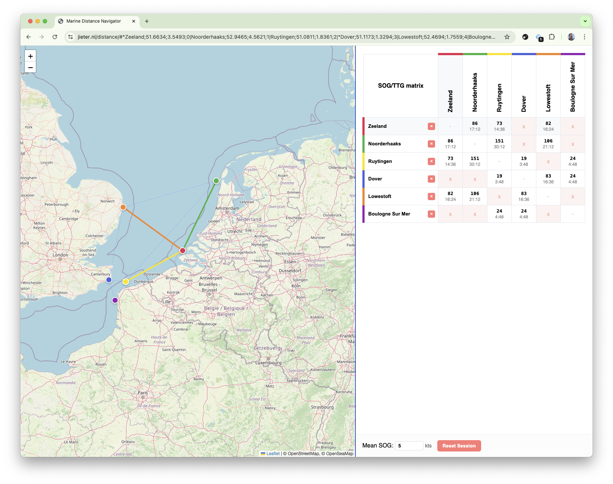

# Destination matrix

When planning trips across larger bodies of water, I often feel the need of a quick distance matrix to get a feel for the distances involved.

This tool allows you add marks on a map by clicking and shows a distance matrix for the connections between them. The mean speed over ground (SOG) can be adjusted to suit your expected average.

Connections can be disabled if they do not make sense by clicking their table cell.

The state of the map is saved in the URL, to allow sharing.

https://jieter.nl/distance/#*Zeeland;51.6634;3.5493;0_Noorderhaaks;52.9465;4.5621;1_Ruytingen;51.0811;1.8361;2_*Dover;51.1173;1.3294;3_Lowestoft;52.4694;1.7559;4_Boulogne%20Sur%20Mer;50.7295;1.5202;5_~1-3_~1-5_~4-5_~2-4_~0-3_~0-5

## Local development

- Install dependencies: `npm install`
- Run development server: `npm run dev`